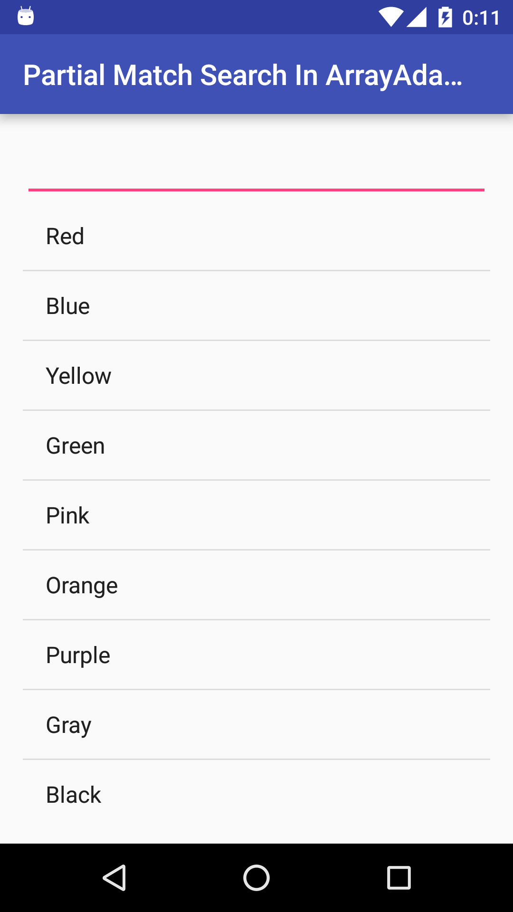
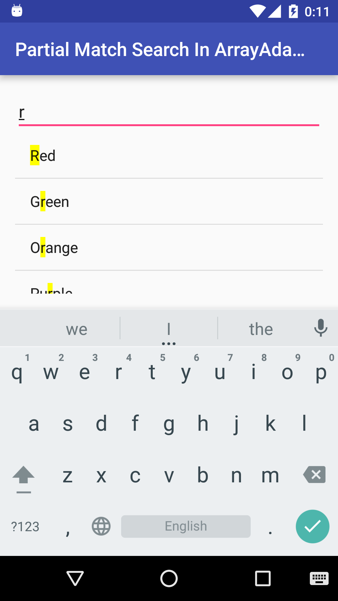

Partial Match Search In ArrayAdapter
==============

This sample is an example of partial match search in ArrayAdapter.

Corresponding Android Version
============

Android 2.1 - Android 6.0

Information
============

* SFApps - <developer@sfapps.jp>
* SFApps Blog - <http://blog.sfapps.jp/>
* Play Store - <https://play.google.com/store/apps/developer?id=SFApps>

License
=======

    Copyright (C) 2015 SFApps
    Copyright (C) 2006 The Android Open Source Project

    Licensed under the Apache License, Version 2.0 (the "License");
    you may not use this file except in compliance with the License.
    You may obtain a copy of the License at

       http://www.apache.org/licenses/LICENSE-2.0

    Unless required by applicable law or agreed to in writing, software
    distributed under the License is distributed on an "AS IS" BASIS,
    WITHOUT WARRANTIES OR CONDITIONS OF ANY KIND, either express or implied.
    See the License for the specific language governing permissions and
    limitations under the License.

